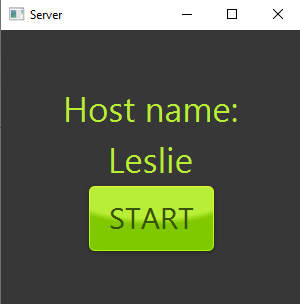
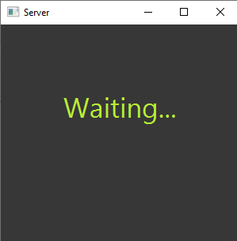
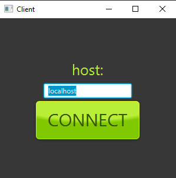
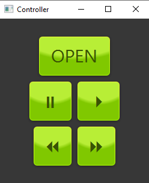
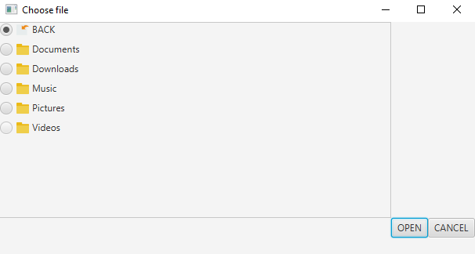

# Media Player
Media player written in Java, that allows you to remotely choose and play movies on a different PC using sockets for communication. Supported file extensions: .mp4 and .flv.
There are 2 applications in this project:
* ServerApplication - it should run on the machine that will play the movie. After starting it will display host name that is used to estabilsh connection.
* ClientApplication - remote controller.

# Getting Started

First you need to run server application. It will display machine name you will use for connecting.

After pressing "start" button it will wait for connection.

Next you need to start client and use machine name to connect to server application.

After that you will see control panel that allows you to open and play a movie on host machine.

Client application uses custom file chooser that retrieves folders and available files from host machine.